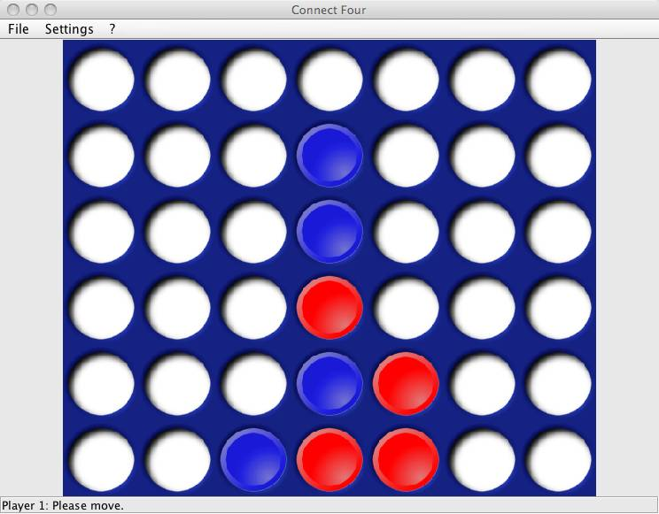

# Connect Four

A Connect Four game. It is possible to compete against another human at one
computer or via a network connection. You can also play against a computer
opponent. The game rules (like the number of rows and columns or the number of
discs needed in a row to win) can be freely configured. This game has been
developed for a project in an university course.

To launch the program you will need Java in version 1.6 or higher. Under Unix
environments (Linux, Mac OS X, …) you can start the program with `connectfour.sh`.
Under Windows you can use `connectfour.bat` for this.

This game was released under the [GNU General Public License, version
3](https://www.gnu.org/copyleft/gpl.html).
